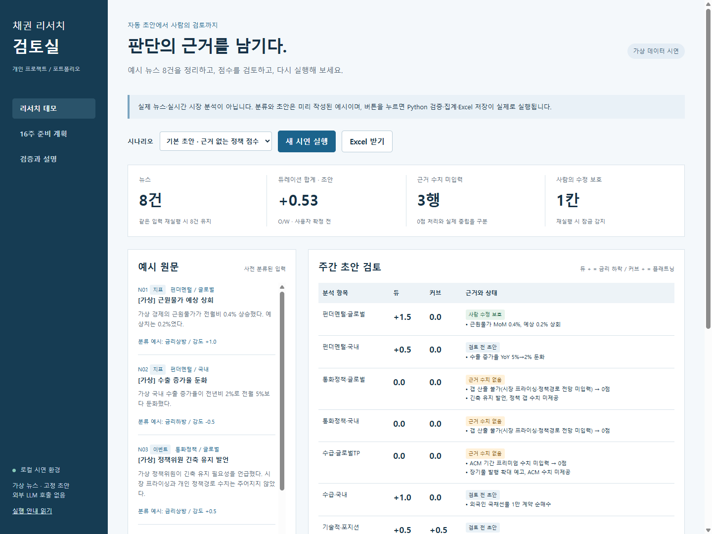

# 채권 리서치 검토실

**채권 리서치의 반복 정리를 줄이고, 사람이 근거를 확인하며 판단을 수정할 수 있는 업무 도구를 만들고 싶습니다.**

개인 데일리 매크로 프로젝트를 바탕으로 만든 학습용 시연입니다. 뉴스에서 정리한 초안을 규칙으로 검증하고, 담당자의 수정값을 보존하며, 실행 이력을 남기는 흐름을 구현했습니다. 자산운용 현업의 업무를 이해하고 이를 신뢰할 수 있는 AI 업무 도구로 구체화하는 것이 목표입니다.

> 현재는 **가상 뉴스 8건과 고정 초안**을 사용합니다. Python 검증·집계·수정 보존·파일 저장은 실제로 실행하지만, LLM 호출과 실시간 뉴스 수집은 아직 구현하지 않았습니다.

[시연 순서](docs/시연대본.md) · [검증 결과](evidence/검증결과.md) · [설계와 한계](docs/설계노트.md) · [실행 안내](docs/실행안내.md)

## 해결하고 싶은 업무 문제

리서치 자료를 반복해서 정리하는 과정에서는 초안을 빨리 만드는 것 외에도 확인할 일이 있습니다. 판단에 필요한 수치가 있는지, 정해진 점수 규칙을 지켰는지, 다시 실행할 때 사람이 고친 내용이 사라지지 않는지 확인해야 합니다. 이 프로젝트에서는 그 검토 과정을 작은 범위로 구현했습니다.

| 확인할 문제 | 현재 시연하는 동작 |
|---|---|
| 수치 근거가 빠지거나 점수 범위를 벗어난 초안 | 정책·기간 프리미엄 관련 규칙과 점수 범위를 Python으로 검증하고, 근거가 없는 항목을 표시합니다. |
| 재실행으로 담당자의 수정이 덮어써지는 문제 | 검토 점수를 바꾼 뒤 같은 초안을 다시 적용해 수정값이 유지되는지 확인합니다. |
| 같은 입력의 반복 추가와 처리 과정 확인 | 같은 실행 내 동일 입력 묶음의 중복 추가를 막고, 실행 이력과 단계별 로그를 남깁니다. |

## 화면과 시연



시연 흐름: **가상 뉴스·고정 초안 → 규칙 검증·집계 → 원문과 결과 검토 → 점수 수정 → 재실행·보존 확인 → Excel 내려받기**

1. `리서치 데모`에서 기본 시나리오의 **새 시연 실행**을 누릅니다.
2. 예시 원문과 분석표를 비교하고, 수치 근거가 없는 항목을 확인합니다.
3. 검토 점수를 **+1.5**로 바꾼 뒤 **수정값 저장 → 재실행·보존 확인**을 누릅니다.
4. 뉴스가 **8건**으로 유지되고, 점수 **+1.5**와 **수정 보호 1칸**이 남는 것을 확인합니다.

## 구현 범위와 검증

| 구분 | 현재 상태 |
|---|---|
| 화면·서버 | HTML/CSS/JavaScript, Python 표준 라이브러리 기반 로컬 HTTP API |
| 처리·저장 | 기존 프로젝트의 Python 규칙 모듈 7개 재사용, openpyxl로 합성 Excel 생성, SQLite 실행 이력, JSONL 로그 |
| 동작 검증 | 정상 처리·규칙 오류·수정 보존·중복 방지·입력 거절 등을 검사하는 데모 테스트 **21개 통과** — [검증 기록](evidence/검증결과.md) |
| 앞으로 구현할 부분 | 실제 LLM 연동, 검색·RAG, MCP, 다중 사용자 인증·권한, 작업 큐와 배포 |

단일 사용자 로컬 시연입니다. 수정 보존은 기존 자동값과의 비교에 의존하며, 동일 입력 묶음의 중복 방지는 기사 단위의 의미 중복을 해결하지 않습니다. 수치가 없어 0점 처리된 항목도 중립 판단과 구분해 읽어야 합니다. 세부 조건은 [설계 노트](docs/설계노트.md)에 정리했습니다.

테스트 결과는 구현한 동작에 대한 확인입니다. LLM 정확도, 실제 업무시간 절감, 외부 사용자 도입 및 투자성과는 아직 측정하지 않았습니다.

## 현재 학습 단계와 다음 목표

기존 개인 매크로 프로젝트를 바탕으로 **Codex의 도움을 받아 시연 코드와 문서를 구현했습니다.** 현재는 Python 기초부터 핵심 로직을 이해하고 직접 수정·검증하는 역량을 쌓는 단계입니다.

1. **핵심 코드 이해와 직접 수정:** 입력 검증, 점수 계산, 수정 보존 로직을 설명하고 작은 변경을 테스트로 확인합니다.
2. **백엔드 기초 확장:** HTTP·SQL을 익히고, 현재 흐름을 API와 데이터베이스 구조로 발전시킵니다.
3. **LLM 연동과 품질 평가:** 실제 모델을 연결한 뒤 근거 누락·오답·악성 입력을 평가하고, 사람의 검토와 권한 관리를 보완합니다.

[16주 상세 학습 계획](docs/준비계획.md)에는 일별 과제와 통과 기준을, [기여·측정 기록 양식](docs/기여와측정.md)에는 앞으로 직접 수행한 변경과 측정 결과를 남길 항목을 정리했습니다.

## 실행하기

Python 3.10 이상이 필요합니다. 저장소 폴더에서 아래 명령을 실행한 후 브라우저로 `http://127.0.0.1:8765`에 접속합니다.

```sh
python -m pip install -r requirements.txt
python -X utf8 app.py
```

Windows 실행 파일 사용법, 종료 방법, 검증 명령은 [실행 안내](docs/실행안내.md)를 참고하세요. 데모는 API 키 없이 동작하며, 입력 기사·기관·수치는 모두 가상입니다.
