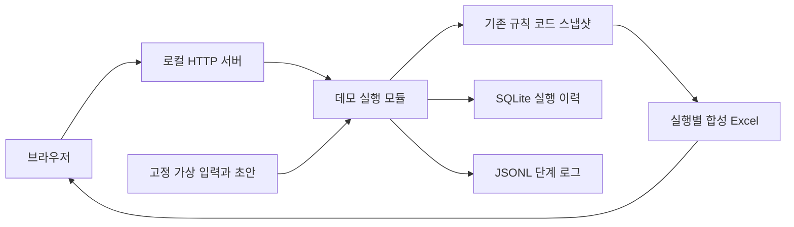

# 설계 노트

## 사용자와 화면

사용자: 매크로 뉴스와 판단을 기록하는 개인 사용자, 자동화 과정을 살펴보는 방문자. 핵심 과제: 원문·초안·수정 보존·실행 증거를 한 화면 흐름으로 설명하기.

레이아웃: 상단의 초안 검토·검증 기록 메뉴와 작업 영역. 원문 검색·유형 필터가 있는 목록과 7행 분석표를 나란히 배치하고, 자동 초안과 현재 검토값을 비교한 뒤 수정→재실행한다. 좁은 화면은 원문→분석 순서로 쌓고, 점수표만 좌우로 스크롤한다. 검색과 필터는 집계 입력을 바꾸지 않는다. [화면 개선 기록](화면개선.md)

일반적인 소개 페이지 대신 실제 검토 표가 중심이다. 장식용 차트·근거 없는 수익률·가상 사용자 수를 넣지 않았다. 강조 지점은 결측과 사람의 수정 보존이다.

## 실행 구조

- engine/ 7개 모듈은 원본 코드 그대로 복사했다. 해시는 evidence/results.json에 기록한다.
- 원본 워크북·inbox·토큰·실제 원문을 읽거나 복제하지 않는다.
- 초안 자동 기입은 기존 draft_apply.apply_draft를 통한다. UI에서 사용자가 요청한 수정은 합성 워크북 G8에만 적용한다.
- DB는 실행 ID·시나리오·완료 상태·시간·오류를 보관한다. 분석 내용은 실행별 파일이다. 단일 트랜잭션으로 DB와 파일을 함께 커밋하는 구조는 아니다.
- 연결은 스레드로 받고, 실행·검토·이력 접근은 잠금 하나로 순서대로 처리한다. 브라우저가 미리 열어 둔 유휴 연결이 서버 전체를 멈추지 않게 하면서 동시 파일 쓰기를 피한다. 긴 작업 동안 다른 실행 요청은 대기하며, 작업 큐는 없다.
- 입력 묶음의 JSON 해시로 같은 실행 내 재추가를 막는다. 의미가 같은 다른 뉴스나 부분 실패 뒤 exactly-once 처리를 보장하지 않는다.
- /api/review는 0.5 단위 유한 점수만 받는다. 경로는 서버가 생성한 실행 ID로 제한한다.
- 127.0.0.1에만 바인딩하고 Host·Origin·서버 임시 토큰을 확인한다. 다중 사용자 인증·역할 기반 권한은 아니다.
- 현재 시연은 고정 입력만 받으므로 악성 원문을 LLM에 넣는 Prompt Injection 평가를 수행하지 않는다.
- 파일 저장은 safe_save를 통한다. 해당 기존 코드의 기본 교체 경로와 예외 시 복사 폴백은 보장이 다르다. 원자적 교체와 동시 작성 충돌 해결을 같은 것으로 설명하지 않는다.
- 검토 점수 저장 직후에는 표의 실시간 합계가 갱신된다. Excel 결론 문구 갱신은 재실행 시 이루어진다.

## 이 시연에 포함하지 않은 항목

LLM 분류·외부 API 호출(원본 파이프라인의 분류 단계는 고정 초안으로 대체), 사용자 자유 입력, 다중 사용자, 작업 큐, 투자성과·시간절감 평가.
